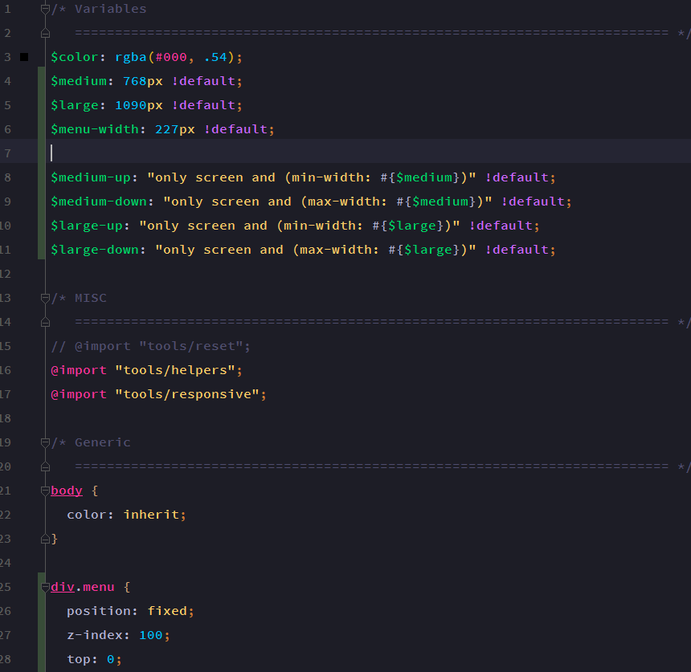
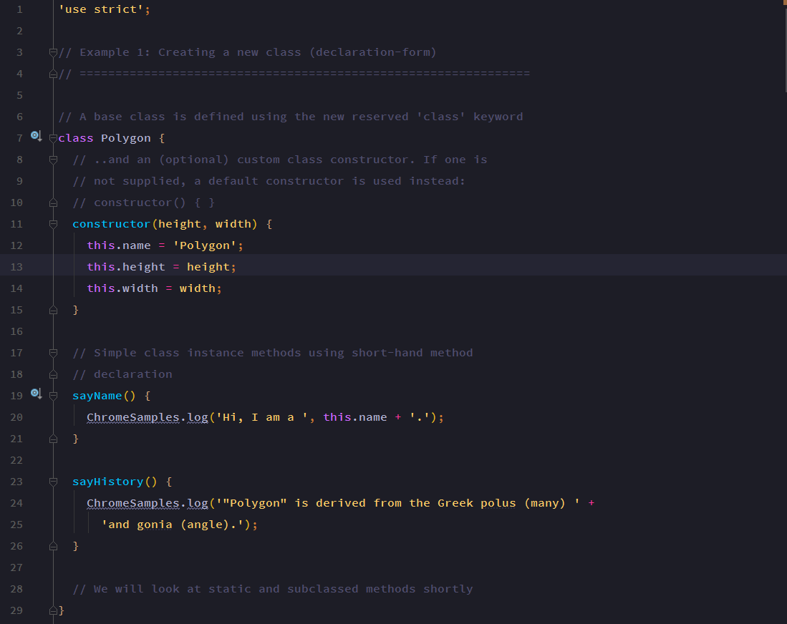
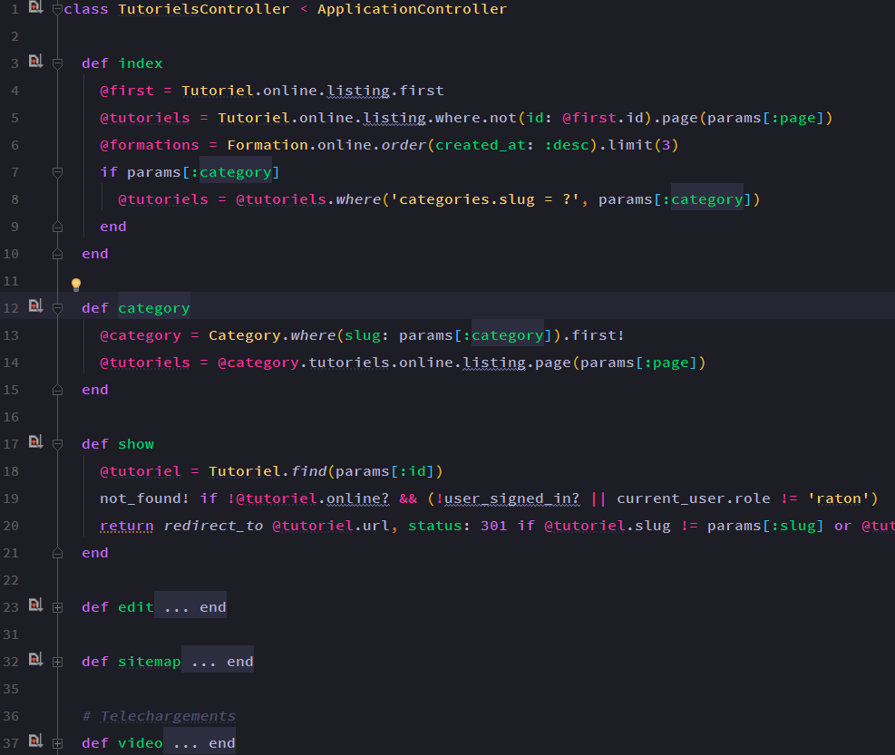
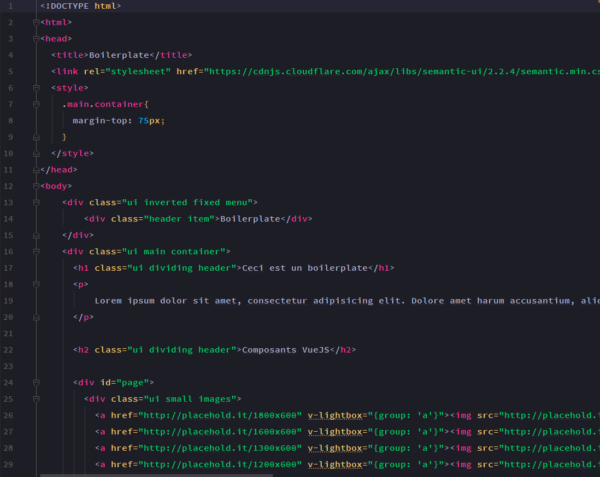
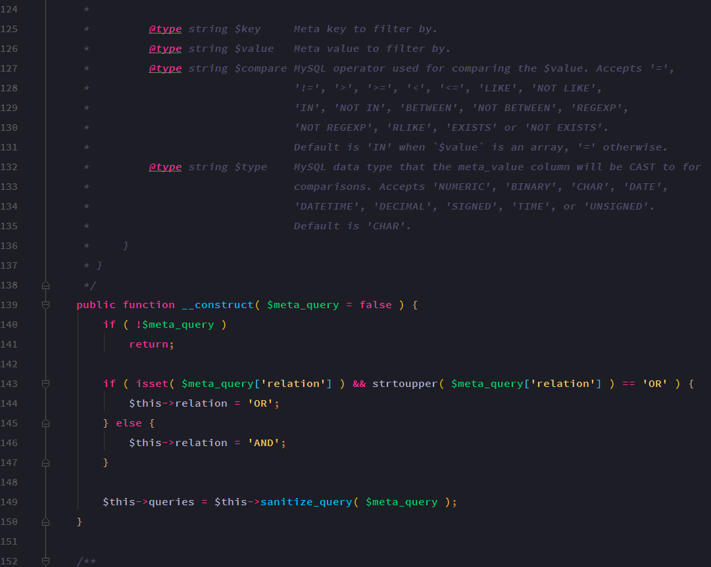
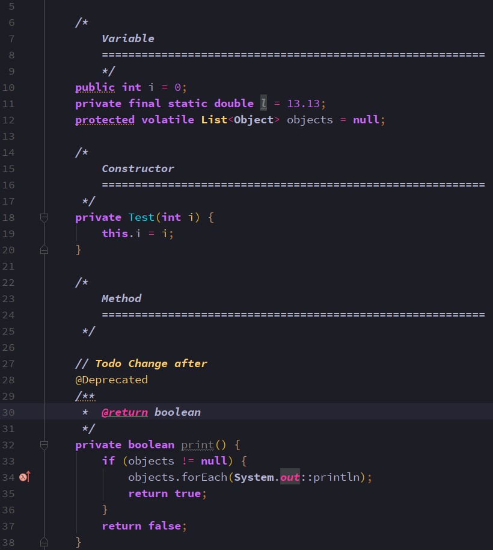
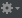

# RoyalTheme
A beautiful the for Intellij

The font used in the IntellijIDEA  [Source Code Pro Semibold](https://github.com/adobe-fonts/source-code-pro).

Also available for :

- [Atom](https://github.com/tinacious/atom-tinacious-design-syntax)
- [Visual Studio Code](https://github.com/tinacious/vscode-tinacious-design-syntax)
- [Sublime Text](https://github.com/tinacious/sublime-tinacious-design-syntax)

### SCSS

### JavaScript (ES6)

### Ruby

### HTML

### PHP

### Java

- [Tinatious] (https://github.com/tinacious)

For install run IntellijIDEA:
Step 1)
  - Download or clone repository

Step 2)
  - File > Settings > Editor > Color Scheme >  > Import Sheme > Intellij IDEA color sheme ... > Select in directory RoyalTheme RoyalThme.icls 
